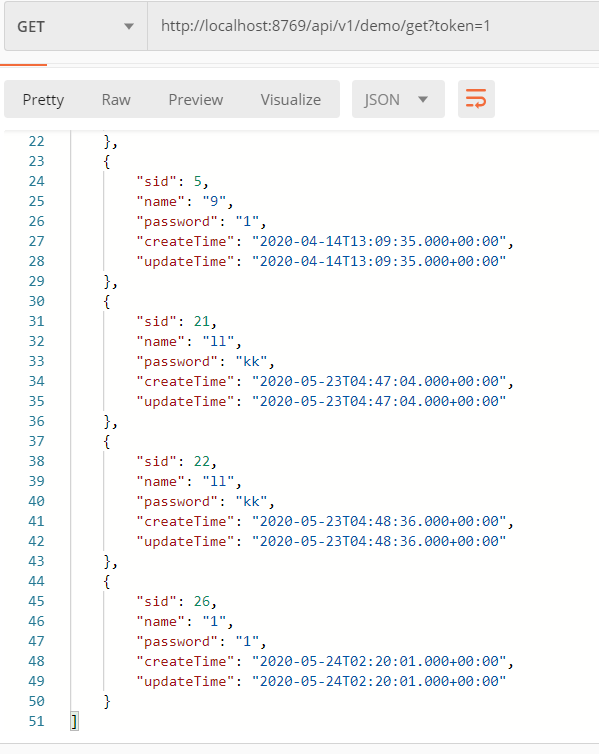
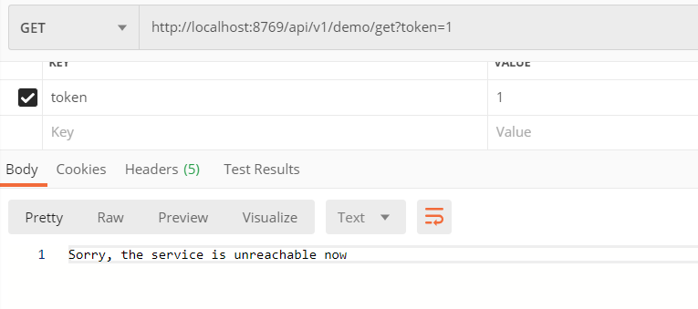
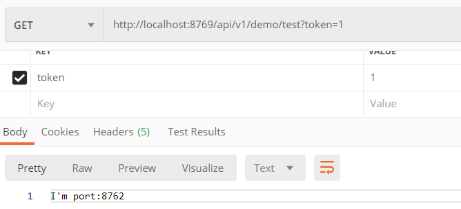
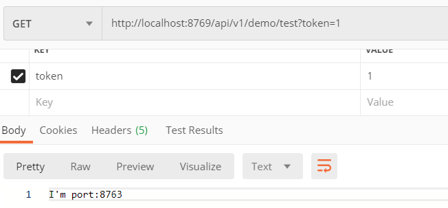

### Spring-Cloud-Demo 
1. 搭建一个空的spring-cloud项目
2. 创建一个eureka-server用来提供服务注册和发现，部署在本地8761端口(访问 http://localhost:8761 即可访问eureka中心 )
3. 创建producer1和producer2两个生产者(application.name=producer-service)，用来提供两个相同服务(主要是为了测试负载均衡)，并向注册中心注册，分别部署在本地8762和8763端口
4. 创建consumer(使用openfegin)(application.name=consumer-service)，Application开启@EnableFeignClients注解，通过@FeignClient调用producer-service,配置文件添加了负载均衡相关配置，同时增加熔断功能，服务不可用时调用MyServiceFallback,开启断路器：Hystrix 仪表盘（本地访问地址：http://localhost:8765/hystrix），向注册中心注册，部署在本地8765端口
5. 创建zuul项目，在配置中将/api/v1/**映射到consumer-service上，添加filter，没有携带token时返回: token is empty，并向注册中心注册，部署在本地8769端口
6. 创建config-server项目，用来从git上(即本仓库的spring-cloud-config文件夹)获取相关配置，向注册中心注册,部署在8888端口
7. 创建config-client项目，从config-server获取config-client-dev.properties配置，向注册中心注册, 访问http：//localhost:8768/(getProjectName/getVersion/getAuthor)调用相对应的serviceId即可返回相应信息
  
一共设计了两个测试接口(注：zuul层加了filter，需添加字段token(任意值即可)才能访问):
1. http://localhost:8769/api/v1/demo/get 返回数据库中的所有学生
2. http://localhost:8769/api/v1/demo/test 用来测试负载均衡，因为采用轮询规则，所有连续访问两次将返回不同端口信息

---------

### Spring-Cloud-Demo (动态更新配置、断路保护、负载均衡)
1. 整合Spring Cloud Bus，添加maven依赖，实现动态更新配置，由于没有进行内网穿透，仅实现了配置的手动刷新，没有配置webhook实现自动刷新
当配置发生变化后，可通过访问http://localhost:8768/actuator/bus-refresh 从而手动刷新  
    1、在config-client和config-server中添加spring cloud bus的 maven依赖，在config-client中添加actuator依赖  
    2、安装RabbitMQ,在config-server配置文件中添加RabbitMQ相关配置
    3、在config-client中配置management.endpoints.web.exposure.include=*暴露所有端点(包括bus-refresh)，从而可以手动刷新  
    4、给配置类添加@RefreshScope来实现代理从而刷新，注：@RefreshScope不可以直接注解Controller，否则Controller中配置变量会得不到刷新
2. 整合Spring Cloud 断路保护(上次作业中已实现) 
    1、由于之前使用的openfegin自带断路器,在consumer中使用feign.hystrix.enabled=true开启即可  
    2、然后只需要在服务接口(此处为MyService)添加@FeignClient(value = "producer-service", fallback = MyServiceFallbackImpl.class)注解，指定fallback类即可，此处当生产者服务不可用时就会调用MyServiceFallbackImpl实现
    3、在ConsumerApplication添加@EnableHystrixDashboard，并添加ServletRegistrationBean方法,开启断路器仪表盘，可用于实时监控服务(访问地址：http://localhost:8765/hystrix)
    4、服务可用截图 + 服务不可用截图：
        
        
3. 整合Spring Cloud 负载均衡，使用openfegin完成  
    1、在Consumer中，配置producer-service.ribbon.NFLoadBalancerRuleClassName=com.netflix.loadbalancer.RoundRobinRule，设置负载均衡算法为RoundRobin轮询  
    2、负载均衡截图：  
        
        

4. openfegin使用：  
    1、添加依赖：  
    ```
        <dependency> 
            <groupId>org.springframework.cloud</groupId>
            <artifactId>spring-cloud-starter-openfeign</artifactId>
        </dependency>
    ```  
    2、@EnableFeignClients 开启注册有 @FeignClient注解的接口
    3、@FeignClient(value = "producer-service", fallback = MyServiceFallbackImpl.class)，注册对应服务名称，以及断路调用的fallback实现类  
    4、目前feign不支持在Controller中异步调用接收返回值，可以在service层通过@Async注解实现


